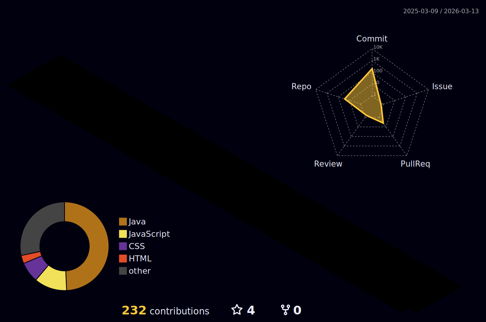

<h1 align="center"> Nikollas Oliveira </h1>

 Estudante técnico de Analise e Desenvolvimento de Sistemas 

---

## ° Estudos
- *Spring Boot*
- *HTML com JavaScript*
- *Padrões de projeto*

---

## ° Tecnologias

 
  

    
    Java
  

  

    
    HTML
  

  

    
    CSS
  

  

  
  JavaScript

---

## ° Contribuições em 3D

---
